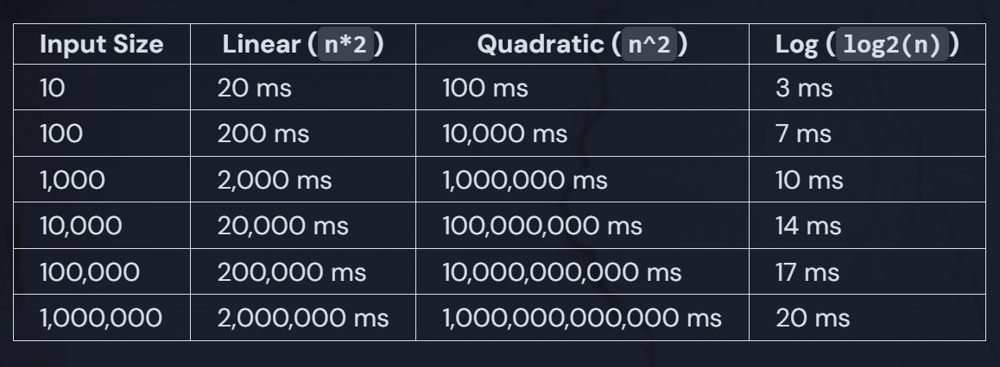
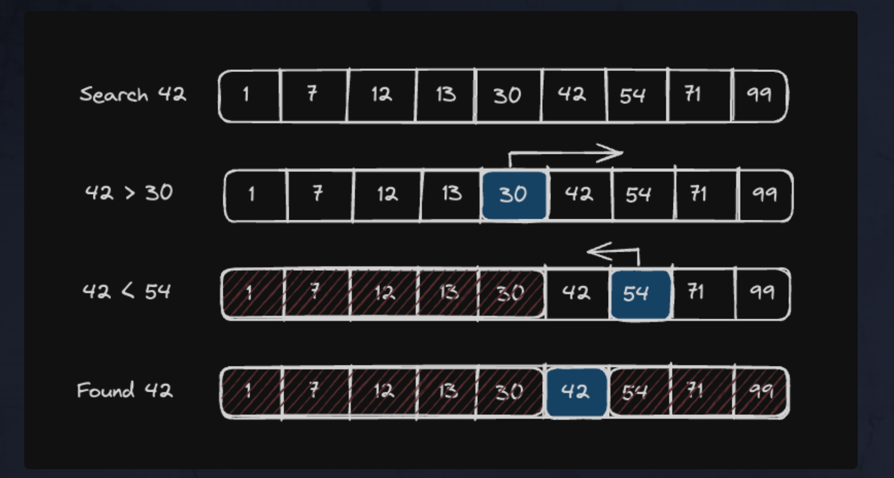
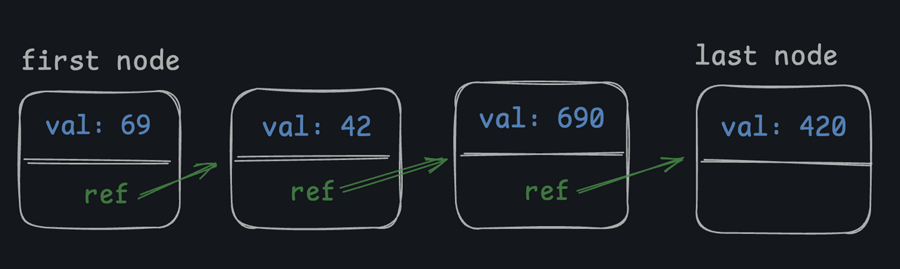
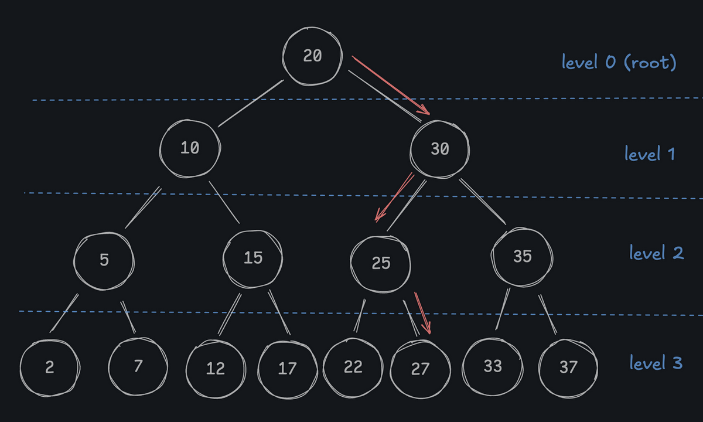
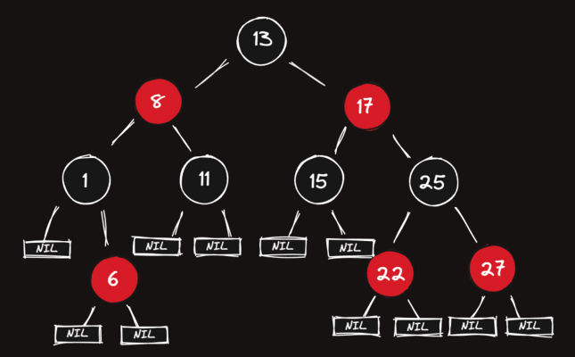
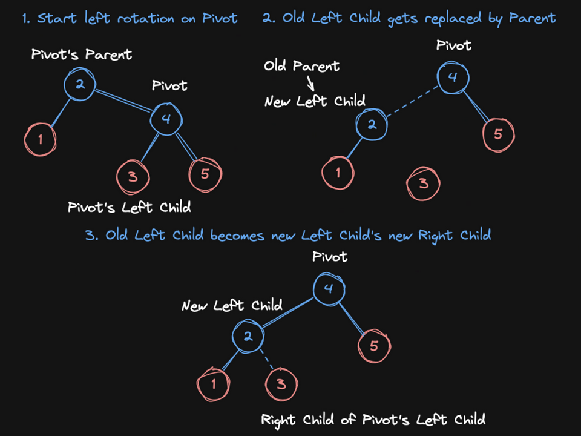
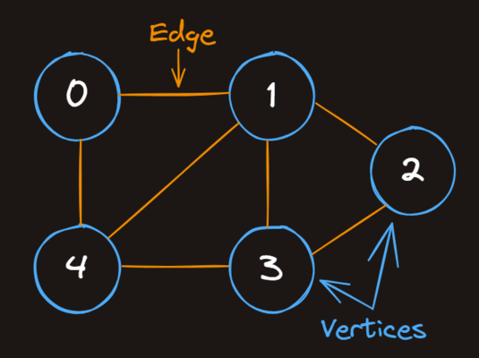

# Data Structures and Algorithms
<br>

## Algorithms

<br>

Algorithms are a set of instructions put together to accomplish a specified task or result, preferably, in the most efficient way possible. In code, practically everything evolves through them. 

A very basic example of an algorithm:

```go
if value % 2 == 0 {
    fmt.Printf("%v is even\n", value)
} else {
    fmt.Printf("%v is odd\n", value)
}
```
<br>

## Math 
<br>

Some of the math concepts that are important to be aware of when writing efficient algorithms are the ones that can clearly represent how slow can a certain algorithmic solution get, as the input grows in size. 

The relevant ones for this case are:

- Exponents
- Factorials
- Logarithms

Exponents and Factorials are the kind one should avoid, as the execution speed of an operation will slow down drastically with exponential time complexity and even more with the factorial kind. 

On the other hand, Logarithms, are considered good representations of execution speed (Polynomial time). Logarithm is the opposite of exponentiation, and can be defined as follows:

`Logarithms show which exponent a base needs to be raised to in order to equal a given number`

For example:

`log2(16)`

Means, what is the number base 2 should be raised to, to equal 16? The answer is 4.

This logarithmic classification of algorithmic execution time, can represent algorithms where at every step of a loop, the given input is divided by 2. 
To actually slow down the speed of execution of an algorithm of this kind, it would need to receive an input squared in size. 

As seen on the table below, the growth rate of logarithms is extremely low, compared to other time complexities:



<br>

We can look at logarithmic time complexity by thinking of how many times we can divide the input, specifically, how many iterations will be needed (worst case growth) to complete the algorithmic operations on a given input size.  

<br>

## Big-O Analysis

<br>

The previous topic leads us to the concept of Big-O Notation.

This could be summarized as a metric to classify how the algorithms grow their time complexity as the input size increases, by identifying the worst possible time complexity it could get, as Big O formulas that we can list below:

- `O(1)`        - constant
- `O(log n)`    - logarithmic
- `O(n)`        - linear
- `0(n log n)`  - linearithmic
- `O(n^2)`      - quadratic
- `O(2^n)`      - exponential
- `O(n!)`       - factorial


<br>

 

<br><br>


### O(1)
Time complexity does not grow as the input size increases, hence the constant designation.

 An example of the efficiency of algorithms of this kind is by looking at how fast we and instantly we can index an array element.

```python

num = [ 23, 14, 7, 80, 75, 12, 1 ]

print(num[1])
```
<br>

### O(log n)
As briefly explained in the previous topic, this classification is almost as good as constant time, since each step of the algorithm splits the input space in half. 

The `Binary Search` algorithm for instance, is `O(log n)`, since at each step, one of the halves of the current input is discarded.  

```python 
def binary_search(target, arr):
    low = 0
    high = len(arr) - 1
    while low <= high:
        median = (low + high) // 2
        if arr[median] == target:
            return True
        elif arr[median] < target:
            low = median + 1
        elif:
            high = median - 1
    return False
```

<br>



<br><br>

### O(n)
The run time of an algorithm slows down as the input increases, in a `linear` way, which is still considered acceptable. If an input of size 1 takes 1 millisecond to complete, then an input of 1000 will take 1000 milliseconds, proportionally.  


```python
def linear_search(nums, target):
    for x in nums:
        if x == target:
            return True
    return False
```
<br>


### O(n log n)
Execution time grows `n * log n`. This is the case of solutions like the `Merge Sort` algorithm, where the input is successively (recursively) split in left and right halves, `O(log n)`. Both of these halves will then be sorted and merged. At each level, the sorting operation of both halves will iterate n times (n = size of the halves), `O(n)`, until they finally get merged together.  


```python
def merge_sort(nums):
    if len(nums) < 2:
        return nums
    first = merge_sort(nums[: len(nums) // 2])
    second = merge_sort(nums[len(nums) // 2 :])
    return merge(first, second)

def merge(first, second):
    final = []
    i = 0
    j = 0
    while i < len(first) and j < len(second):
        if first[i] <= second[j]:
            final.append(first[i])
            i += 1
        else:
            final.append(second[j])
            j += 1
    while i < len(first):
        final.append(first[i])
        i += 1
    while j < len(second):
        final.append(second[j])
        j += 1
    return final
```
<br><br>


### O(n^2)
Run time grows quadratically as the input size increases. The time it will take to complete the operation will grow very quickly. For example, a nested loop with the inner loop iterating on the same input as the outer loop.  

```python
def insertion_sort(nums):
    for i in range(len(nums)):
        j = i
        while j > 0 and nums[j - 1] > nums[j]:
            nums[j], nums[j - 1] = nums[j - 1], nums[j]
            j -= 1
    return nums
```

**Best case:** If the data is pre-sorted, insertion sort becomes really fast (O(n)), since the inner loop never runs. 

**Average case:** The average case is `O(n^2)` because the inner loop will execute about half of the time.

**Worst case:** If the data is in reverse order, it's still `O(n^2)` and the inner loop will execute every time.

<br><br>

### O(2^n)
Exponential growth. The worst kind of algorithm alongside factorial. It will grow to ridiculous run time values in a blink of an eye. 


```python 
def fib(n):
    if n == 0:
        return 0
    if n == 1:
        return 1
    return fib(n - 1) + fib(n - 2)

print(fib(10))  # 55
print(fib(100)) # can't even compute, but result would be 354,224,848,179,261,915,075 
```

<br>

### O(n!)
Factorial. The worst case growth rate possible, where it could reach the product of each positive integer <= n. 

```python
def permutations(items):
    if not items:
        return [[]]

    result = []
    for i in range(len(items)):
        rest = items[:i] + items[i+1:]
        for p in permutations(rest):
            result.append([items[i]] + p)

    return result

results = permutations([14, 12])
for r in results:
    print(r)

# [14, 12]
# [12, 14]

results = permutations([53, 57, 80, 75])
for r in results:
    print(r)

# [53, 57, 80, 75]
# [53, 57, 75, 80]
# [53, 80, 57, 75]
# [53, 80, 75, 57]
# [53, 75, 57, 80]
# [53, 75, 80, 57]
# [57, 53, 80, 75]
# [57, 53, 75, 80]
# [57, 80, 53, 75]
# [57, 80, 75, 53]
# [57, 75, 53, 80]
# [57, 75, 80, 53]
# [80, 53, 57, 75]
# [80, 53, 75, 57]
# [80, 57, 53, 75]
# [80, 57, 75, 53]
# [80, 75, 53, 57]
# [80, 75, 57, 53]
# [75, 53, 57, 80]
# [75, 53, 80, 57]
# [75, 57, 53, 80]
# [75, 57, 80, 53]
# [75, 80, 53, 57]
# [75, 80, 57, 53]

```

<br>


## Polynomial vs. Exponential 

<br>

When reflecting on the efficiency of algorithms, we can classify their nature generally, using 2 distinct categories, `Polynomial` and `Exponential`. 

The `Polynomial` group, contains all of the algorithms that have a Big O time complexity classification lower or equal to the quadratic kind, `O(n^2)`, or more specifically, `O(n^k)`, where `k` could be any constant value, since Big O does not measure constants, only growth rate proportional to the input size. 

All of the algorithms classified as `Polynomials` are considered fast and practical to use.

The remaining growth rate classifications, `O(2^n)` (exponential) and `O(n!)` (factorial) are classified as `Exponential`, meaning they are extremely slow to run and should not be used at all when implementing efficient solutions. 

From what I know to this day, these `Exponential` algorithms are useful as overhead strategies, security wise, to avoid brute force attempts (like password hacks), since the time complexity necessary in order to attempt to decode or go through all of the possible combinations for a target sensitive data, would be drastically increased. 

<br>

## Data Structures 

<br>


Structures that allow data to be stored and managed according to their specific needs, providing internal methods (algorithms) to access, order and modify collections of elements. 

Different situations and needs, may require specific data structure logic in order to allow for a more efficient and practical method of accessing, ordering and modifying elements, hence the existence of structures such as:


`Linear data structures`:

- Dictionaries
- Sets
- Tuples
- Arrays/Lists
- Linked Lists
- Stacks
- Queues

`None Linear data structures`:

- Binary Trees
- Red Black Trees
- Tries
- Graphs
- ... 

<br>

### Arrays/Lists

Classic storage structure that stores elements contiguously in memory, allowing basic operations like adding, indexing, iterating, removing, ordering. 

<br>

### Dictionaries

Container that stores `key/value` pairs. Very efficient data structure that allows immediate lookups (`O(1)`) through the key of each element.

Dictionaries are `hashmaps` because all of their `keys` are `hashed` (transformed) into unique indexes through a `hash function`, responsible for executing an algorithm for this purpose.     

Dictionaries/hashmaps also use arrays under the hood to effectively store the values, indexing them to the position computed from the hashed value taken from their corresponding key. 

<br>


### Sets

Collection of unordered unique elements. 

<br>

### Tuples

Immutable, ordered collection of elements that can store mixed types together.

<br>

### Linked Lists

Sequence of nodes containing data and a reference (`pointer`) to the next `node` in the collection (and a second pointer to the previous node in the case of `Double Linked Lists`). This data structure does not hold its elements contiguously in memory only keeping their order through references. 

<br>




<br>

### Stacks

Similar to arrays but more limited in how they operate access wise. They are famously know for being `Last in First Out`, only allowing access to the element at the top of the list. The most popular example of its use is with the CPU itself, where function call operations are managed in memory through this structure, `pushing` and `popping` data as the function gets called or as it returns (`unwinds`).

Another common example of its use is with `undo` operations, where the last inserted element needs to be reached and retrieved immediately in `O(1)` time. 

<br>

### Queues

Queues are also similar to arrays but with their own quirks and limitations, like the stack. This structure is `First In First Out`, and is commonly used in situations where elements need to be retrieved in the order they were inserted in. 

An example of the usage of `Queues` are the `Breadth First Search` and `Depth First Search` algorithms, which I will describe further down below. 

<br>

The above structures are considered `Linear Data`, where the elements are stored either contiguously in memory or in an ordered sequence with references to each other (Linked Lists). 

We will now take a look at some `Non Linear Data` examples:

<br>

### Binary Trees:

Hierarchical relation of node connections, starting at a root point, where each node can have up to two child nodes.

The usefulness of trees comes into place when inserting elements with the intent of ordering their storage. For instance, a `Binary Search Tree` organizes nodes by placing them in order from the root level downward, redirecting them by checking if the inserted value is higher or lower than the current position. If the value is lower, the value will proceed down to the left (left child) until a free spot (`null`) is found, otherwise, it will go to the right side (right child) executing the same logic. A `Binary Search Tree` does not have nodes with the same values, only unique elements.

The time complexity of `BST` is `O(log n)` in tree structures that are not drastically `unbalanced`. When searching for a value in a `BST`, each level splits the available number of nodes in half, making it very efficient overall.

One known problem of this simple `BST` structure is that its structure may end up `unbalanced`, with one of the sides extending deeply in relation to the opposite side. This will have a negative impact in the efficiency of the structure when searching/inserting values.

For example, if we insert a series of pre-sorted elements into a `BST`, the tree will grow exclusively to the right side, since all of the values inserted will be higher than the current level, extending to its right child, each time, creating a completely unbalanced structure. 

<br>




<br>

### Red Black Trees

To solve the problem mentioned previously, we can make use of a Red Black Tree structure. This is a `self-balancing` tree, which will handle possible unbalanced cases by rotating a tree section around a pivot node. This rotation happens due to an additional `color` attribute each node contains, defining when the tree needs to be rebalanced, rotating the nodes and recoloring them as needed. 


<br>



<br>

The rule using this attribute (color) will take place when inserting or removing values from the tree. For example, a constraint exists not allowing a node marked as red to have a red marked parent. If this is the case, a condition of the algorithm will be executed to rotate the nodes left or right until the balancing state condition is fulfilled.

<br>



<br>


This will avoid inserting new nodes repeatedly on the same branch because every new node inserted into the tree starts with a red mark. 

Another rule informs that any path traveled from a node down to the `null` child of a `leaf node` (in any direction) must encounter the same number of black nodes (non red markings) along the way.


<br>

### Tries

Tries use nested dictionaries, where the key/keys of each level is the current character of the stored word. The value of each key, is another dictionary holding a key to the next character of the string and so on and so forth. 

These data structures are very useful for finding words with the same prefix or in cases where an autocompletion needs to take place, since it is very fast and accessible to verify words available that match the same prefix. 

For example, the words:

- hello
- help
- hi

Would be represented as:

```python
{
	"h": {
		"e": {
			"l": {
				"l": {
					"o": {
						"*": True
					}
				},
				"p": {
					"*": True
				}
			}
		},
		"i": {
			"*": True
		}
	}
}
```
_The `*` character (paired with `True` instead of a dictionary) is used to indicate the end of a word_.

<br>

### Graphs

Network of connections between `Vertices`, where each connection is represented by an `Edge`. 

<br>



<br>

Graph connections can be represented as matrices (`Adjacency Matrix`) which is a `2D Array`, where each Array element holds a sequence of `True` or `False` values representing each `Vertex` connection (`Edge`) 

<br>


<br>

or, 

as an `Adjacency List`, more specifically, a list of dictionaries, where each key is a `Vertex` with its corresponding value being a list of adjacent `Vertices` (neighbors). 

<br>


<br>


Graphs allow more complex connection relationships and traversal possibilities in comparison with   `Linked Lists` or `Binary Trees`, such that, instead of only allowing single chains of connections between nodes or nodes with up to 2 children, they provide the ability for a Vertex to connect to multiple other Vertices, as well as cycling back to the starting Vertex or, having connections between Vertices that are separated from other clusters of connections (no `Edges` between them). 

<br>

##  Breadth First Search and Depth First Search

We can now talk about 2 important traversing algorithms, which can be used with Trees and Graphs.

Breadth First Search (`BFS`), starts at an arbitrary given root (any `node` on a `Tree` or `vertex` on a `Graph`), and traverses all of the adjacent nodes/vertices on the current level until finally moving deeper in the structure. `BFS` is practical when we know before hand that the value we are looking for lives somewhere close to the root. 

<br>


<br>


Depth First Search (`DFS`), is similar, but, instead of traversing horizontally one level at a time, it traverses down each level until the leaf node before coming back up to continue with the next neighboring branch. `DFS` is very good for cases where we know that the target value is very distant from the root. 


<br>


<br>

## NP vs. P

`NP` (Nondeterministic polynomial time):  

- Set of problems whose solutions can be verified in `Polynomial` time. 

- `NP` problems might not have `Polynomial` solutions, even if they can be verified in `P`. 


We can see this in practice by looking at an algorithm that has the worst time complexity of all, `O(n!)`, for instance, a `Travel Salesman Problem` type problem, that looks for a path  sequence that goes through all of the cities in a graph, summing a total distance that is less than a given distance.

If we have a Graph with 4 cities, we will need to permutate all the possible combinations (4!). This is order `O(n!)`. 

This problem is in `NP`. Why? Because even though the solution is extremely slow to complete, we can verified it in `O(n)`, by summing all the distances between each pair of cities in the solution in a loop iterating the `n` input (complete matrix of distances between cities) and comparing the result with the target value. 


<br>


### NP-Complete

A problem is `NP-Complete` if it is in `NP` and if every other problem in `NP` can be reduced to it in `Polynomial` time.

<br>

#### NP-Hard

Similar definition as `NP-Complete` but the problem does not need to be in `NP` - does not need to be verifiable in 'P' -  as opposed to the former. 

`NP-Hard` problems are at least as hard as 'NP-Complete` problems, with the penalty of possibly being worse, to the point where no `P` verifiable is possible. 

Every `NP-Complete` problem is also `NP-Hard` but not the opposite. 

<br>

The `NP` vs `P` case arises with the question: is `P` = `NP`? 

This would be the case if a `Polynomial` solver for an `NP-Complete` problem could be found, meaning that every other problem in `NP` could be reduced to it and consequentially solved in `Polynomial` time. 

To this day, it has been impossible to prove if either `P = NP` or `P != NP` are true.

