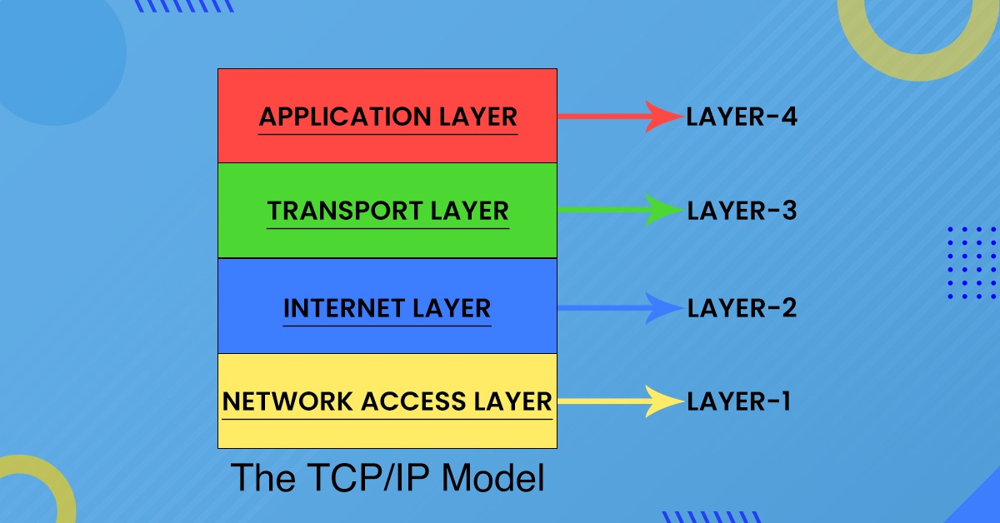
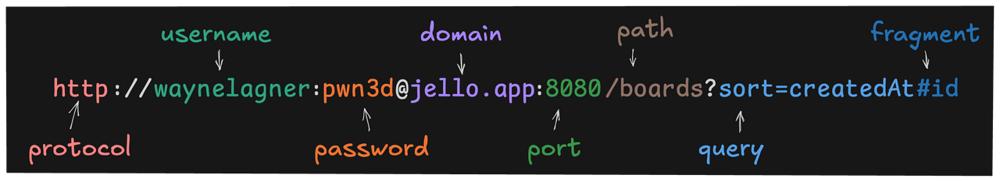

# Networking

<br>

## OSI Model

<br>

The `OSI` (Open Systems Interconnection), is a networking conceptual model with 7 layers, describing how data moves  between computers over a network. `OSI` is a theoretical reference model, which defines standards on how network communications should work.

The 7 layers are:

- `Application`: Which communication protocols the user interacts with. 
- `Presentation`: How the data is formatted/encoded and encrypted.
- `Session`: Manages connections.
- `Transport`: Responsible for delivering data using a defined transport protocol.
- `Networking`: Handles addressing and routing of packets.
- `Data Linker`: Handles communication between devices. Uses `MAC Addresses` (hardware addresses).
- `Physical`: Transmission of raw bits through physical media (cables, signals, ...)

<br>

## TCP/IP (Transmission Control Protocol/Internet Protocol) Model

<br>

Also a logical model for data delivery over the network, but has concrete practical implications, since it is the model used for real-world communications and the Internet. 

Due to this practical implication, it has a simpler 4 layer structure which merges some of the ones in the `OSI` into the same category, for example, `presentation` and `session` belong to the `application` layer. The last 3 layers of `OSI` are combined in the `network Access` layer.

The `internet` layer, replaces the name `networking` from `OSI`, and is responsible for addressing and routing packets, specifically with the use of `IP` addresses. 

<br>

 

<br>


It defines transport protocols such as `TCP` and `UPD` as part of the architecture. `HTTP` is also one of the most common communication protocols used in the `application` layer. 

The terms `TCP` and `IP` in the model name are direct references to how the model works, transporting packets over the wire through reliable or unreliable protocols (`TCP` or `UDP`), and deciding where they need to be delivered with the use of `IP` addresses. 


### TCP 

Transport protocol that guarantees `packets` are delivered in the same order they are sent, tagging the segments of data with headers of metadata. It requires a series of acknowledgements from the receiver side, to confirm delivery. 

This is the reliable method to transfer data and the standard in the Internet, even though carrying a bigger overhead of operations, which makes it slower than `UDP`.


### UDP

Unreliable but faster than `TCP`. It does not have the same overhead because it doesn't concern itself with delivering packets in the order they were sent, nor does it check if they where successfully delivered. 

This protocol is preferable in contexts where the priority is to deliver the data as fast as possible. Real-time transmission of data is an example of its use, like `streaming` platforms. 

Due to its unreliability in favor of speed, additional logic needs to be written on the client and server side, to make sure that the data is being delivered properly. 

<br>

 

<br>

## HTTP 

`HTTP` (`Hypertext Transfer Protocol`) is the web communication protocol (text-based protocol) commonly used in the application layer, and it is used to send and receive messages between clients and servers. 

This communication is done with requests and responses, through a vehicle called the `HTTP Message`, containing internal information about what is being sent or received. 

This internal information consists of defined format standards, documented by the HTTP `RFC` (`Requests for Comments`):

```
start-line CRLF
*( field-line CRLF )
CRLF
[ message-body ]

```

`start-line`: request line, containing the HTTP method (verb), the target and the HTTP version. Example: 

```
POST /coffee HTTP/1.1            # start-line CRLF
```


`field-line`: multiple lines of header key-value pairs, which specify details concerning the request/response:

```
Host: localhost:42069            # *( field-line CRLF )
User-Agent: curl/8.6.0           # *( field-line CRLF )
Accept: */*                      # *( field-line CRLF )
Content-Type: application/json   # *( field-line CRLF )
Content-Length: 22               # *( field-line CRLF )
```

`Carriage return and line feed`: CRLF is sequence of carriage return and line field characters (`"\r\n"`) that need to be present at the end of each line and also between the headers and the body:

```
CRLF
```


`Body`: Body of the `HTTP` message. If there is body content to be sent, the `Content-Length` header key will need to inform exactly how many bytes it contains, in order for the receiver to properly read the data without `EOF` errors. The `Content-Length` field can be omitted or set to 0,  if there is not body:   

```
{"flavor":"dark mode"}          # [ message-body ]
```

### HTTP URLs

`URL` (`Uniform Resource Locator`), is the address of a server or computer on the Internet. 

The `URL` contains the actual location of the server, represented by the domain name, for example, youtube.com. This domain name is a humanly readable reference to an underlying `IP` address, which is managed and fetched by the `DNS` (`Domain Name System`). 

Besides containing the actual address of the server, which is only part of the `URL`, the remaining pieces could be paths or endpoints, inside the server, where the client targets its requests. These endpoints could also extend additional query and fragment parts, specifying more detailed information about what the client is requesting from the path.


<br>

 

<br>

 

<br>


