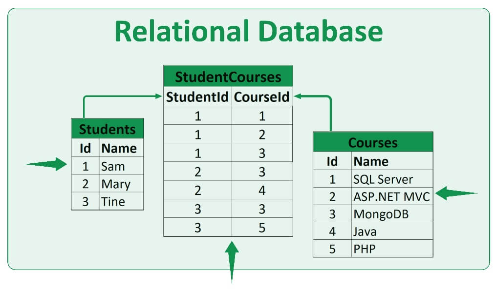

# RELATIONAL DATABASES

<br>

## What is a relational database

Type of database meant to store data so that in can be related to other data. 

A `relational database` stores data in tables and links them using keys, enforcing relationships and constraints while supporting `CRUD` operations.

These 'CRUD' operations on the database are executed with code, more specifically `queries`. There are different query languages available for developers to work with databases, like `SQL` systems and non `SQL` systems.

Relational databases, data is structured in the following way:

- `Tables` representing data.
- Each table has `columns` or `fields`.
- Contains `rows`, which can be called `records` or `entries`
- Each `record` normally has a `primary key` (unique `id`)

<br>



<br>

## Migrations

A `migration` is an incremental updated version ('up' migration) of the initial table (`schema`). This is done to allow the table to be scalable, in steps, while tracking each version of its previous state. This is very important because we can easily revert the state of the table to a previous version, by way of a `down` migration. 

Another important aspect of executing a migration on a table, is to carefully check the current queries (code), and update them if necessary, to avoid having them accessing columns that might not exist any longer. 

A good migration should be created in a way which will allow it to be reversible.

<br>

## Null values 

A 'null' value is a cell that does not hold any value. A column can have a `constraint` that specifies if the value can or cannot be 'null'.

## Constraints

An rule set to columns, while defining the schema, explicitly limiting them to a given `constraint`. For example, if we add a `name` column to a table and set it to have a 'NOT NULL' constraint, we guarantee that the value received through the query will never be `null`. 

## Primary key

A special column that is set to each `row` of a `table`, guaranteeing their unique identification. Mostly used as a `constraint` on an `ID` column. This is crucial to protect each record uniqueness while interacting with other tables. 

## Foreign keys

Essential to create relationships between tables. A foreign key, is a named constraint created for a column (or columns), forcing referential integrity (concept of ensuring that the referenced value exists) by requiring that the value set or received matches a valid primary key (or unique key) from the given referenced table. 

```sql
rental_id INTEGER,
CONSTRAINT fk_rentals
FOREIGN KEY (rental_id)
REFERENCES rental(id);
```

This will ensure that the `foreign key`, `rental_id`, will contain a valid key from the `rental` table. 

## Schema 

The blueprint structure of the created database. It defines all of the aspects of how the data is organized, from the tables themselves, to the types of each column, their constraints and how the tables are related to each other, through their references (foreign keys). 

## ORM 

`Object-Relational Mapping` is a tool that maps database records to in-memory objects. The big benefit of its use is that it allows `CRUD` operations to be executed with more standard programming languages, instead of manually typing queries every time we need to interact with the database. 

For example, a `table` named `user` from a relational database, can be represented in code as:

```go
type User struct {
    name string
    age int
}
```

The type `User`, is the `table` `User` from the database and each of its instances is a `record` (`row`) of that `table`.

`ORM` will also allow functions to be created in order to interact with the object, which will subsequently update the actual data living in the relational database. 


